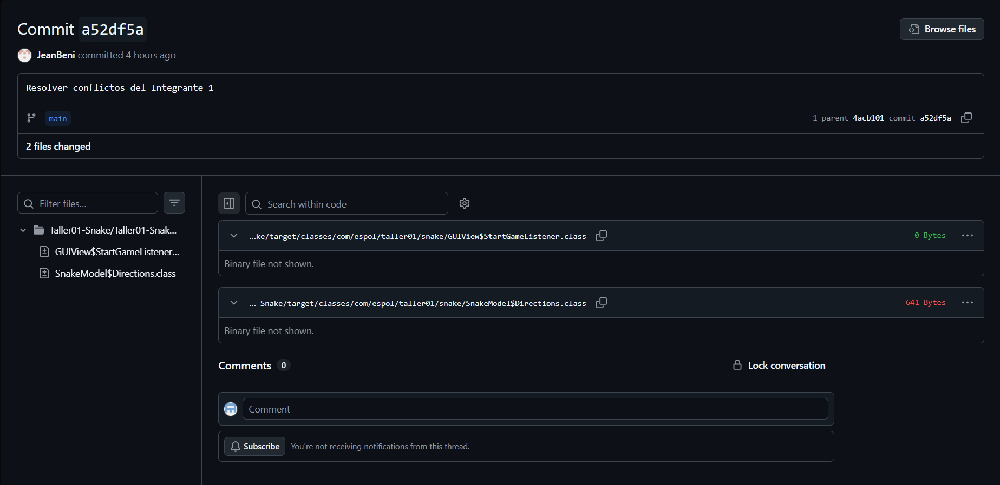

# Taller01_Snake_DS## Integrantes y roles

Complete esta tabla al final del taller.

| Rol | Nombre | Usuario de GitHub | Commit principal |
| --- | --- | --- | --- |
| Líder | Justin Soto| Justinsoto2005|Personalizar botón y colores principales|
| Integrante 1 |Jean Benites|JeanBeni|Cambiar botón y cabeza de snake|
| Integrante 2 |Daniel Segarra|hodoka05|Cambiar botón y colector de gold|
| Integrante 3 |Kevin Vera|kebimvh|Cambiar botón y colector|

## Evidencias

Coloque las capturas dentro de una carpeta llamada `capturas/` y enláselas en esta sección.

Ejemplo:

```markdown
### Líder

Push exitoso:


### Integrante 1

Error antes de resolver conflicto:


Push exitoso después de resolver conflicto:



### Integrante 2

Error antes de resolver conflicto:


Push exitoso después de resolver conflicto:


### Integrante 3

Error antes de resolver conflicto:


Push exitoso después de resolver conflicto:


```